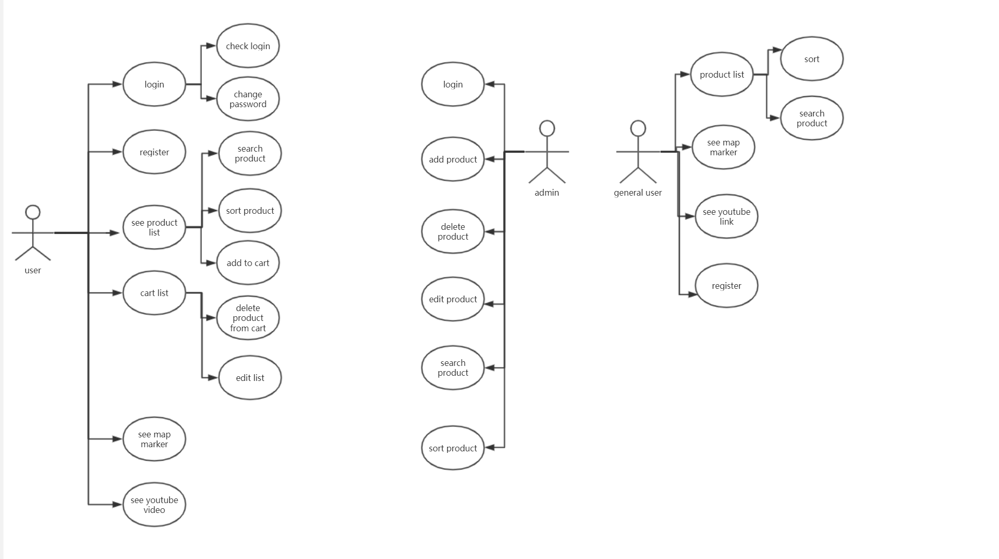
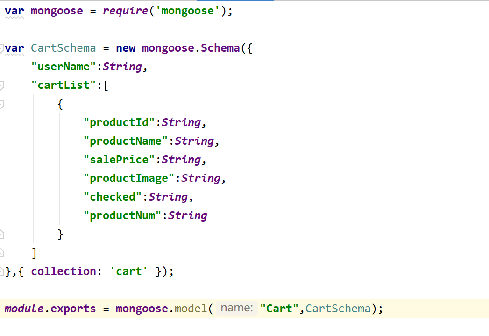
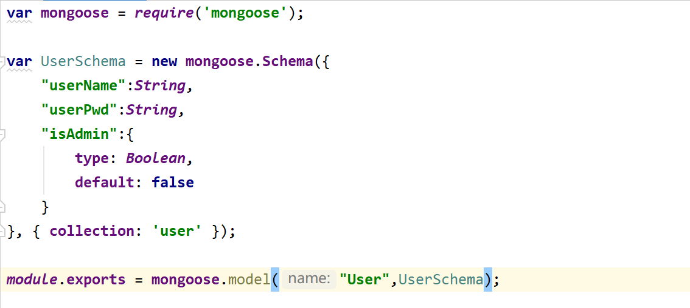
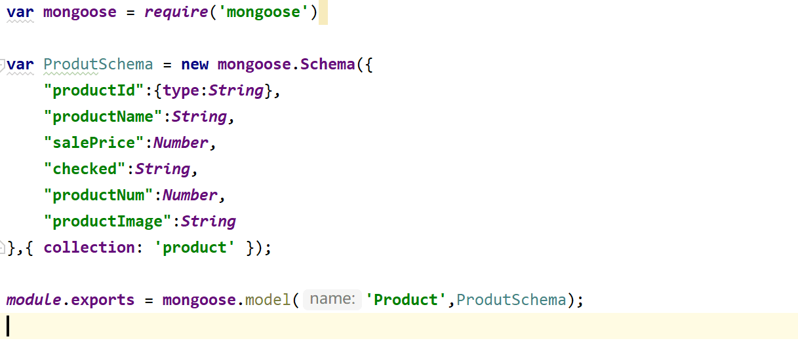
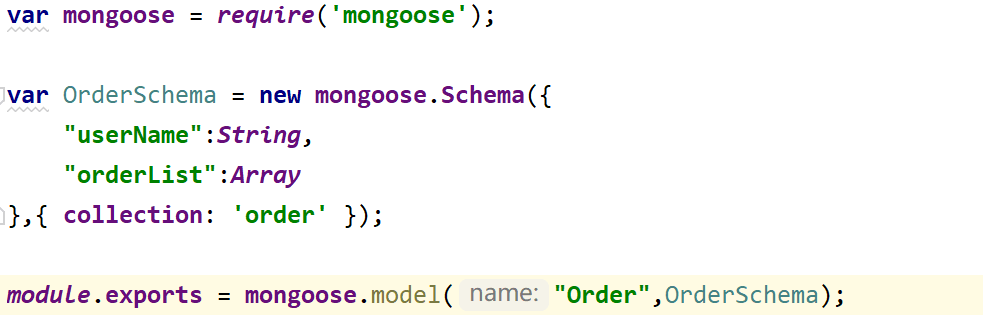

# Flowershop-front
- [Youtube](https://youtu.be/xwDiNY9fEPI)
- Table Of Contents
  - [Fowershop-front](#Flowershop-front)
    * [Basic Information](#basic-information)
    * [Environment](#environment)
    * [Usage](#usage)
    * [Description of Functionality](#description-of-functionality)
    * [UML Diagrams](#uml-diagrams)
    * [Database Schemas](#database-schemas)
    * [Git Approach](#git-approach)
    * [UX/DX Approach](#ux-dx-approach)
    * [References](#references)

## Basic Information
- ID: 20086441
- Name: Yiyuan Gao

## Environment
- OS: Windows 10
- Node: v10.16.3

## Usage
- Clone:
```
git clone https://github.com/gyyyyyy/flowershop-front.git
```
- Configure:
```
cd <your_dir>
npm install
```
- Run:
```
npm run start
```
- Test(Cypress):
```
npm run cypress:open
```

## Description of Functionality
- Client:
  >The client can be divided into 2 parts: `UI for frontend`and `UI for backend`.
  - Urls:
    - [Github](https://github.com/gyyyyyy/flowershop-front)
    - [Gitlab(with CI/CD)](https://gitlab.com/gyy01467/flowershop-front)
    - [Heroku](https://flowershop-front.herokuapp.com/)
  - Functions:
    >This section only shows a brief description of functionalities of the client, a more detailed description with screenshots can be seen in [Gitlab(with CI/CD)](https://gitlab.com/gyy01467/flowershop-front).
    - General user:
      - Login:
      - Register
      - Change password
      - Check login
      - Product list
      - Search product
      - Sort product
      - Map marker
      - Youtube video
      - add to cart
      - delete from cart
      - edit cart list
    - Admin:
      - Login
      - add product
      - delete product
      - sort product
      - search product 
- Server:
  - Urls:
    - [Github](https://github.com/gyyyyyy/flowershop-master)
    - [Gitlab(with CI/CD)](https://gitlab.com/gyy01467/flowershop-master)
    - [Heroku](https://flowershop-master.herokuapp.com/)

- Frameworks used:
  - Client:
    - Vue CLI
    - Vue-Router
    - Vuex
    - Node
  - Server:
    - MongoDB
    - Vue.js
    - Express
    - Node
- 3rd party APIs:
  >This application uses `4` 3rd party APIs in total, they are listed as follow.
  - Maps:
    - Google Maps Javascript API.
    - Google Map Marker API
  - Youtube:
      - Youtube video API.
  - Image Upload:
      - Image Inputer API.
## UML Diagrams
- Use case diagrams:
  

## Database Schemas
>There are `4` very `complex` and `nested` schemas adopted in the server of this application.

- Cart 

- User

- Product 

- Order



## Git Approach
- Both of the client and server adopts `Git` locally, while using `Github` and also `Gitlab` as the remote repositories for management.
- The status of the repositories are all `public`.
- Please refer to the `commits` for my commiting records.
- The urls of repositories are listed as follow:
  - Server:
    - [Github](https://github.com/gyyyyyy/flowershop-master)
    - [Gitlab(with CI/CD)](https://gitlab.com/gyy01467/flowershop-master)
  - Client:
    - [Github](https://github.com/gyyyyyy/flowershop-front)
    - [Gitlab(with CI/CD)](https://gitlab.com/gyy01467/flowershop-front)

## UX/DX Approach
- UX
  - use complex ui design, obey the design principle
  - use addtional api to upload image, can drag image to upload, and can automated upload
  - use element ui to design
- DX
   - use cypress to test
   - automated test
   - use cypress dashboard to record the test
   - use CI/CD method and git lab pipeline
   - deploy to cloud platform

## References
- Develop:
  - [Vue.js](https://vuejs.org/index.html)
  - [Vue CLI](https://cli.vuejs.org/)
  - [Vue Router](https://router.vuejs.org/)
  - [Vuex](https://vuex.vuejs.org/guide/)
  - [Node.js](https://nodejs.org/zh-cn/)
  - [Node's official docs](https://nodejs.org/zh-cn/docs/)
  - [sha1](https://www.npmjs.com/package/js-sha1)
  - [jsonwebtoken](https://www.npmjs.com/package/jsonwebtoken)
  - [ElementUI](https://element.eleme.cn/#/en-US/component/installation)

- MongoDB:
  - [MongoDB](https://www.mongodb.com/)
  - [MongoDB Atlas](https://www.mongodb.com/cloud/atlas)
  - [Mongoose](https://mongoosejs.com/)
  - [Mongoose docs](http://www.nodeclass.com/api/mongoose.html#quick_start)
  - [A blog of MongoDB about Schema and Model](https://www.jianshu.com/p/29c55aae3d6f)

- Test:
  - [mocha](https://mochajs.org/)
  - [A blog about Mocha](http://www.ruanyifeng.com/blog/2015/12/a-mocha-tutorial-of-examples.html)
  - [lodash](https://lodash.com/)
  - [eslint](https://eslint.org/)
  - [A blog about jwt](http://www.ruanyifeng.com/blog/2018/07/json_web_token-tutorial.html)
  - [A blog about jwt](https://www.jb51.net/article/162523.htm)
  - [A blog about jwt](https://segmentfault.com/a/1190000014062679?utm_source=tag-newest)
  - [chai](https://www.chaijs.com/)
  - [Mongodb-Memory-Server](https://github.com/nodkz/mongodb-memory-server)
  - [supertest](https://github.com/visionmedia/supertest)
  - [nyc](https://github.com/istanbuljs/nyc)
  - [nock](https://github.com/nock/nock)
  - [Postman](https://www.getpostman.com/)
  - [local-web-server](https://www.npmjs.com/package/local-web-server)
  - [cypress-file-upload](https://github.com/abramenal/cypress-file-upload)
- Google Maps:
  - [A blog about Google Maps Javascript API](https://alligator.io/vuejs/vue-google-maps/)
- CI/CD:
  - [A blog about Firebase Hosting Deployment Automation with Gitlab CI](https://medium.com/@rambabusaravanan/firebase-hosting-deployment-automation-with-gitlab-ci-f3fad9130d62)
  - [A blog about Automatically deploy to Firebase with Gitlab CI](https://medium.com/evenbit/automatically-deploy-to-firebase-with-gitlab-ci-546f194c44d8)
  - [Firebase - Share project resources across multiple sites](https://firebase.google.com/docs/hosting/multisites)

